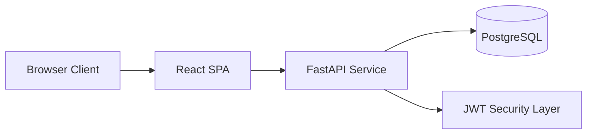
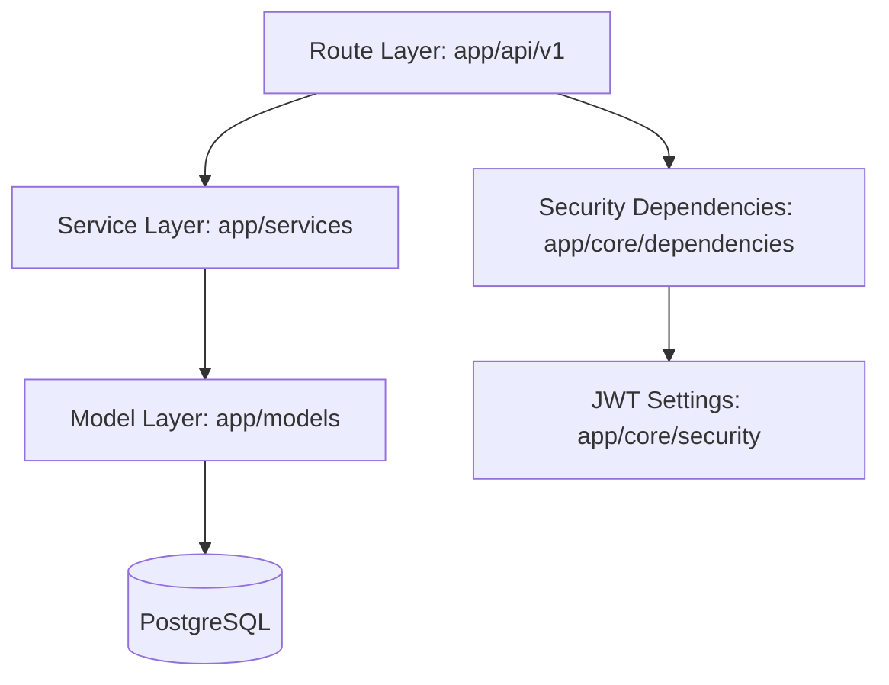
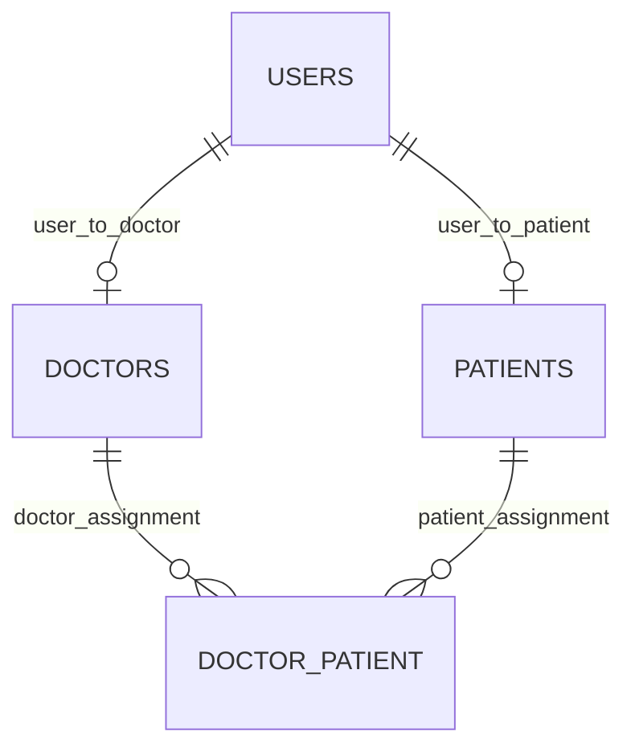
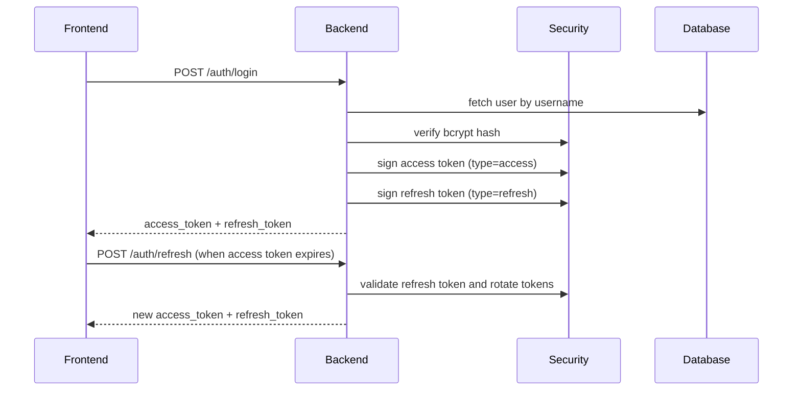
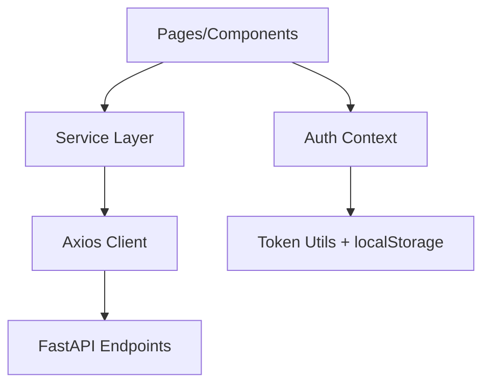
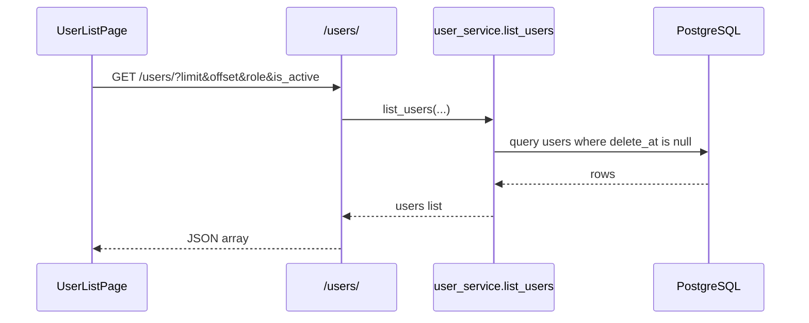
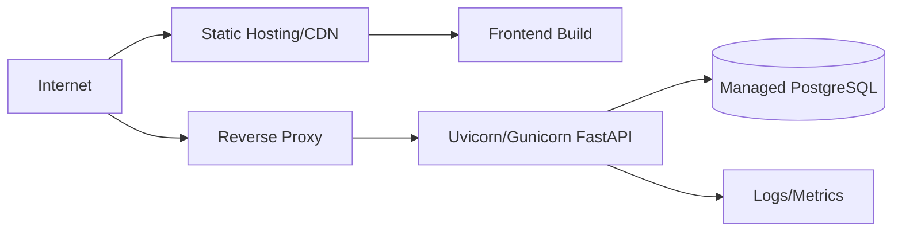

# ARCHITECTURE
## Patient Management System

## 1. Architectural Goals

- Keep business logic explicit and readable for learning and extension
- Separate API, service, and data access concerns
- Enforce access control at API boundary
- Support role-aware UI with clear endpoint mapping
- Maintain schema evolution through Alembic migrations

## 2. System Context



### 2.1 Component Responsibilities

- React SPA: user interaction, role-aware rendering, API orchestration
- FastAPI: HTTP contract, validation, security dependencies
- Service layer: business rules and use-case orchestration
- SQLAlchemy ORM: relational mapping and persistence
- PostgreSQL: source of truth for identities and assignments

## 3. Backend Layered Architecture



### 3.1 Route Layer

- Defines endpoint contracts
- Applies dependency injection for DB sessions and auth
- Handles route-level ownership checks where needed

### 3.2 Service Layer

- Encapsulates create/update/delete/list flows
- Owns duplicate checks and data-side validation
- Keeps route handlers thin

### 3.3 Data Layer

- SQLAlchemy models map domain entities
- One-to-one profile relation from user to doctor/patient
- Many-to-many doctor-patient relation via association table

## 4. Data Architecture

### 4.1 ER Model



### 4.2 Relational Design Notes

- `users` is identity anchor table
- role value controls authorization semantics
- profile tables (`doctors`, `patients`) carry role-specific fields
- `doctor_patient` supports many-to-many assignment cardinality

### 4.3 Data Lifecycle

- Hard delete physically removes `users` row
- Soft delete sets `users.delete_at`
- restore clears `delete_at`
- list endpoint omits soft-deleted users

## 5. Security Architecture

### 5.1 Authentication



### 5.2 Authorization Control Planes

- RBAC plane:
  - `require_role(["admin", "super_admin"])` on admin endpoints
- Ownership plane:
  - doctor and patient lookup endpoints validate identity linkage

### 5.3 Trust Boundary

- Frontend role checks are usability controls
- Backend dependency checks are enforcement controls
- Database remains inaccessible directly from frontend

## 6. Frontend Architecture



### 6.1 Routing Design

- Public routes: login
- Protected route wrapper for authenticated areas
- Role-aware navigation choices by decoded JWT payload

### 6.2 API Access Design

- Centralized Axios instance
- Request interceptor injects token
- Response interceptor attempts `/auth/refresh` on 401 and retries once
- If refresh fails, both tokens are cleared and user is logged out
- Normalized error adapter for backend error formats

## 7. Critical Runtime Flows

### 7.1 User Listing Flow (Paginated)



### 7.2 Assignment Ownership Flow

```mermaid
flowchart TD
    A[GET /assignments/doctor/{id}/patients] --> B{Role}
    B -->|admin/super_admin| C[Allow]
    B -->|doctor| D{doctor_profile.id == path id}
    D -->|yes| C
    D -->|no| E[403]
    B -->|patient or others| E
```

## 8. Deployment Architecture (Recommended)



## 9. Architecture Decisions and Tradeoffs

### 9.1 Chosen Decisions

- SQLAlchemy ORM over raw SQL for readability and safety
- JWT stateless auth for simple scaling
- Service layer pattern for testability and separation
- Vite proxy for local CORS simplification

### 9.2 Current Tradeoffs

- Some user mutation endpoints do not currently enforce auth dependency
- Middleware/exception handlers in `app/main.py` are duplicated and should be consolidated

## 10. Evolution Plan

- Harden authorization on all mutation routes
- Add composite uniqueness on assignment relation
- Add refresh token revocation/blacklist support
- Add observability and structured logging pipeline
- Introduce CI checks for migration consistency and security linting

---

This architecture document is aligned with the current implementation and can be used as a system-design reference for interviews, reviews, and academic submissions.
