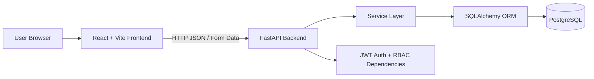
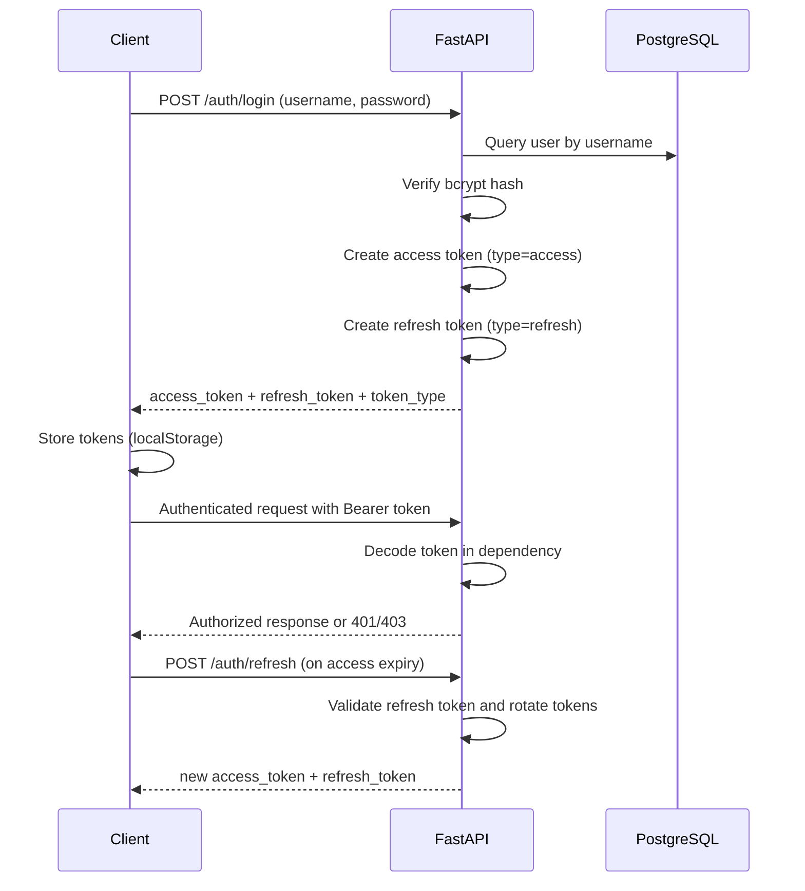
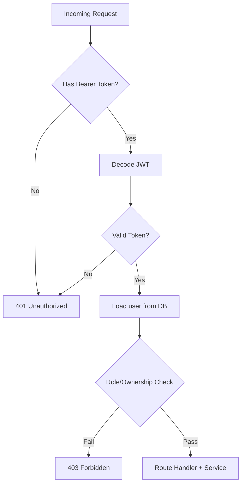
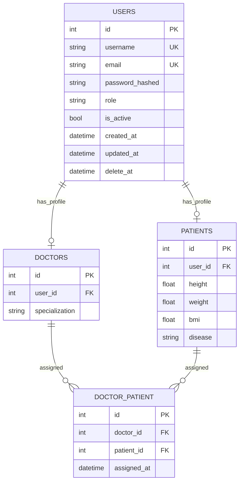

# PROJECT DOCUMENTATION
## Patient Management System (Full-Stack)

## 1. Project Overview

### 1.1 Project Name
Patient Management System

### 1.2 Problem Statement
Healthcare workflows require controlled access to patient and doctor data. In unmanaged systems, it is difficult to enforce who can view or modify records, maintain secure authentication, and track assignments between doctors and patients.

### 1.3 Objective
Build a secure, role-aware, full-stack system that supports:

- User management
- Doctor-patient assignment
- JWT-based authentication
- JWT access and refresh token workflow
- Role-based and relationship-based authorization
- Soft delete and restore workflows
- End-to-end frontend integration for API operations

### 1.4 Key Features

- JWT login (`POST /auth/login`)
- Refresh token rotation (`POST /auth/refresh`)
- Role-based access control (`admin`, `super_admin`, `doctor`, `patient`)
- Relationship-based access checks for assignment lookups
- Admin-only user creation endpoint access
- Super admin delete protection (hard/soft delete blocked)
- User CRUD with `PUT`, `PATCH`, pagination/filtering
- Hard delete, soft delete (`delete_at`), restore
- Many-to-many doctor-patient association
- Structured frontend pages for all non-DB endpoints

### 1.5 Target Users

- `super_admin`: full administrative operations
- `admin`: administrative operations
- `doctor`: limited views of own assigned patients
- `patient`: limited views of own assigned doctors

### 1.6 System Scope

In scope:

- Core user identity and role management
- Assignment mapping between doctors and patients
- Authentication and authorization enforcement
- Frontend dashboards/forms for all business APIs

Out of scope:

- Medical record files/imaging workflows
- Notification delivery (SMS/email/push)

---

## 2. System Architecture

### 2.1 High-Level Architecture Diagram



### 2.2 Frontend-Backend Communication

- Frontend uses Axios with base path `/api`
- Vite proxy rewrites `/api/*` to backend `http://127.0.0.1:8000/*`
- Login request uses `application/x-www-form-urlencoded`
- Business APIs use JSON payloads and query/path params

### 2.3 Database Interaction

- FastAPI route handlers call service functions
- Service layer performs ORM queries/mutations
- SQLAlchemy session lifecycle is managed by dependency injection (`get_db`)
- Alembic handles schema evolution and migration history

### 2.4 Authentication Flow (JWT)



### 2.5 Role-Based Access Design

- RBAC via `require_role([...])` dependency
- Relationship-based checks in assignment route handlers:
  - doctor can view only own patients
  - patient can view only own doctors
- admin and super_admin can query broader data

### 2.6 Request/Authorization Flow



### 2.7 ER Diagram



---

## 3. Database Design

### 3.1 Core Tables

#### `users`

| Column | Type | Constraints | Purpose |
|---|---|---|---|
| `id` | Integer | PK, indexed | Internal user identifier |
| `username` | String(50) | unique, not null | Login identity |
| `email` | String(100) | unique, not null | Contact/login identity |
| `password_hashed` | String | not null | Bcrypt hash |
| `role` | String(20) | not null | Authorization role |
| `is_active` | Boolean | default true | User activity flag |
| `created_at` | DateTime TZ | server default now() | Audit timestamp |
| `updated_at` | DateTime TZ | onupdate now() | Audit timestamp |
| `delete_at` | DateTime TZ | nullable | Soft delete marker |

#### `doctors`

| Column | Type | Constraints | Purpose |
|---|---|---|---|
| `id` | Integer | PK, indexed | Doctor profile ID |
| `user_id` | Integer | FK -> `users.id`, not null | User linkage |
| `specialization` | String(100) | not null | Domain specialization |

#### `patients`

| Column | Type | Constraints | Purpose |
|---|---|---|---|
| `id` | Integer | PK, indexed | Patient profile ID |
| `user_id` | Integer | FK -> `users.id`, not null | User linkage |
| `height` | Float | nullable | Clinical metric |
| `weight` | Float | nullable | Clinical metric |
| `bmi` | Float | nullable | Clinical metric |
| `disease` | String(255) | nullable | Condition summary |

#### `doctor_patient`

| Column | Type | Constraints | Purpose |
|---|---|---|---|
| `id` | Integer | PK, indexed | Association ID |
| `doctor_id` | Integer | FK -> `doctors.id` | Doctor reference |
| `patient_id` | Integer | FK -> `patients.id` | Patient reference |
| `assigned_at` | DateTime TZ | server default now() | Assignment timestamp |

### 3.2 Relationships

- One `users` record may have one `doctors` profile
- One `users` record may have one `patients` profile
- Doctors and patients are linked many-to-many through `doctor_patient`

### 3.3 Soft Delete Strategy

- Soft delete uses `users.delete_at`
- Soft-deleted users remain physically in DB
- `list_users` excludes rows where `delete_at` is not null
- `restore_user` sets `delete_at` back to null

### 3.4 Indexing Strategy

Current indexing:

- Primary key indexes on ID columns
- Explicit index on `users.id`
- Explicit index on `doctor_patient.id`
- Unique constraints on `users.username` and `users.email`

Recommended index additions for production:

- `users(role)` for role-based filtering
- `users(delete_at, is_active)` for active list queries
- Composite unique index on `doctor_patient(doctor_id, patient_id)`

### 3.5 Migration Strategy (Alembic)

- Migration tooling: Alembic
- Applied/available revisions include:
  - initial schema
  - soft delete column
  - doctor-patient table creation
- Current migration history includes placeholder revisions with `pass`; use caution when extending lineage and keep migration chain clean.

---

## 4. Backend Documentation (FastAPI)

### 4.1 Tech Stack

- FastAPI
- SQLAlchemy ORM
- Alembic
- PostgreSQL
- python-jose (JWT)
- Passlib + bcrypt

### 4.2 Folder Structure

```text
app/
|- api/v1/
|  |- auth.py            # login endpoint
|  |- users.py           # user CRUD + restore endpoints
|  `- doctor_patient.py  # assignment and lookup endpoints
|- core/
|  |- security.py        # token creation and JWT settings
|  `- dependencies.py    # token decode + RBAC guard dependencies
|- db/
|  |- session.py         # SQLAlchemy engine and SessionLocal
|  `- deps.py            # get_db dependency
|- models/
|  |- user.py
|  |- doctor.py
|  |- patient.py
|  `- doctor_patient.py
|- schemas/
|  |- user.py
|  |- auth.py
|  |- doctor.py
|  `- patient.py
|- services/
|  |- user_service.py
|  `- doctor_patient_service.py
`- main.py               # app setup, middleware, exception handling
```

### 4.3 Authentication

- Passwords are hashed with bcrypt via Passlib
- Login endpoint validates credentials and returns both access and refresh tokens
- JWT payload includes:
  - `sub` (user ID)
  - `role`
  - `exp` (expiration)
- JWT token type includes:
  - `type=access`
  - `type=refresh`
- Token expiration controlled by `ACCESS_TOKEN_EXPIRE_MINUTES`
- Refresh token expiration controlled by `REFRESH_TOKEN_EXPIRE_DAYS`
- Token validation is implemented in dependency (`get_current_user`)

Access vs refresh concept:

- Access token: used in `Authorization: Bearer` for protected routes
- Refresh token: used at `POST /auth/refresh` to renew session
- Current implementation rotates refresh token on refresh

### 4.4 Authorization

- RBAC with `require_role([...])`
- Route-level ownership checks for doctor/patient assignment lookups
- Super admin logic currently mirrors admin in allowed-role lists

### 4.5 CRUD Operations

User operations:

- Create: `POST /users/` (`admin`/`super_admin` only)
- Get by ID: `GET /users/{user_id}` with self/admin restriction
- List: `GET /users/` with pagination/filtering (`limit`, `offset`, `is_active`, `role`)
- Full update: `PUT /users/{user_id}`
- Partial update: `PATCH /users/{user_id}`
- Hard delete: `DELETE /users/{user_id}`
- Soft delete: `DELETE /users/{user_id}/soft_delete_user`
- Restore: `POST /users/{user_id}/restore`
- Super admin users cannot be hard-deleted or soft-deleted

### 4.6 Logging and Error Handling

Logging:

- HTTP middleware logs method, path, status, and processing time
- Current `main.py` includes repeated middleware definitions; behavior should be consolidated for production clarity

Error handling:

- Custom `HTTPException` handler returns structured payload:
  - `success: false`
  - `error.code`
  - `error.message`
- Endpoint/service layers raise `HTTPException` for auth, validation, and authorization failures

### 4.7 Doctor-Patient Logic

- `doctor_patient` table models many-to-many assignment
- Assignment endpoint prevents duplicate mapping at service level
- Admin/super_admin can assign and view broad relationships
- Doctor/patient lookups enforce ownership checks based on profile IDs

---

## 5. Frontend Documentation (React)

### 5.1 Tech Stack

- React + TypeScript
- Vite
- Axios
- React Router
- React Hook Form + Zod
- Vitest + Testing Library + MSW

### 5.2 Folder Structure

```text
frontend/src/
|- components/      # reusable UI pieces (tables, feedback, nav, status)
|- context/         # auth context provider
|- hooks/           # useAuth, role guard hooks
|- layouts/         # auth/app layout shells
|- lib/             # axios client, token utils, error normalization
|- pages/           # route pages mapped to backend endpoints
|- router/          # browser router + protected route setup
|- services/        # typed API service methods
|- styles/          # theme tokens + layout + component styles
|- test/            # smoke tests and MSW handlers
`- types/           # API contracts and domain typings
```

### 5.3 Authentication Handling

- Tokens stored in localStorage (`pms_access_token`, `pms_refresh_token`)
- Axios request interceptor adds `Authorization: Bearer <token>`
- Axios response interceptor attempts token refresh on `401`
- If refresh fails, interceptor clears both tokens and logs out
- Protected routes redirect unauthenticated users to `/login`
- Token payload decoded client-side for role-aware navigation

### 5.4 Pages Overview

- `LoginPage`: authenticate user with role-select modes (doctor, patient, admin; admin mode includes super_admin)
- `DashboardPage`: health status and quick links
- `UserCreatePage`: create account (`admin`/`super_admin` access)
- `UserListPage`: pagination and filters
- `UserDetailPage`: user detail view
- `UserUpdatePage`: PUT update
- `UserPatchPage`: PATCH update
- `UserActionsPage`: hard delete / soft delete / restore
- `AssignPatientPage`: create doctor-patient assignment
- `DoctorPatientsPage`: query patients by doctor
- `PatientDoctorsPage`: query doctors by patient
- Profile concept: represented by `/users/:id` ("My Details")
- For doctor/patient roles, profile view shows `doctor_id` / `patient_id` from profile tables

### 5.5 API Integration Strategy

- Service files wrap endpoint calls (`authService`, `userService`, `assignmentService`, `healthService`)
- Shared error normalization supports:
  - custom `{ error: { message } }`
  - FastAPI `detail`
  - 422 array-based validation details
- Loading/error/success states are shown per action

---

## 6. Integration Flow

### 6.1 Login Flow

1. User submits username/password on frontend login page.
2. Frontend calls `POST /auth/login` (form-encoded).
3. Backend validates credentials and returns access + refresh tokens.
4. Frontend stores tokens and routes user to dashboard.

### 6.2 Token Exchange Flow

1. Frontend reads access token from localStorage.
2. Axios interceptor appends Bearer token.
3. Backend decodes token in dependency and loads user.
4. On access-token expiry (`401`), frontend calls `POST /auth/refresh`.
5. Backend validates refresh token and issues new token pair.
6. Frontend retries the original request with new access token.

### 6.3 Role-Based UI Rendering

- Navigation links are shown based on decoded token role
- Sensitive pages still rely on backend authorization as source of truth
- Frontend displays inline "forbidden" state for denied role access

### 6.4 Assignment Flow

1. Admin/super_admin submits doctor and patient IDs.
2. Backend validates referenced entities and duplicate association.
3. On success, relation row is inserted.
4. Doctor/patient lookup pages query relationship endpoints.

### 6.5 Pagination Flow

1. User list page captures `limit`, `offset`, `role`, `is_active`.
2. Frontend sends query parameters to `GET /users/`.
3. Backend filters/limits result set and returns page slice.

### 6.6 Soft Delete Visibility

1. Admin triggers soft delete on a user.
2. Backend sets `delete_at` timestamp.
3. Subsequent `GET /users/` excludes soft-deleted rows.
4. Restore endpoint clears `delete_at`, making user visible again.

---

## 7. Security Considerations

- Password hashing: bcrypt via Passlib
- JWT expiration: enforced through `exp` claim and verification
- Role validation: server-side `require_role` and ownership checks
- Access restriction: protected endpoints require token dependencies
- SQL injection resistance: ORM query construction via SQLAlchemy
- Data isolation: doctor/patient endpoints enforce ownership constraints

Security improvements recommended:

- Refresh token revocation / blacklist strategy
- Rate limiting on login endpoint
- More granular audit logging
- CORS hardening for production origin list

---

## 8. Deployment Strategy

### 8.1 Backend Deployment

- Deploy FastAPI with Uvicorn/Gunicorn behind reverse proxy (Nginx)
- Run Alembic migrations in CI/CD before app rollout
- Configure environment via secret manager

### 8.2 Frontend Deployment

- Build static assets via `npm run build`
- Host on static provider (Vercel/Netlify/S3+CloudFront)
- Configure API base/proxy for target environment

### 8.3 Database Hosting

- Managed PostgreSQL (RDS/Cloud SQL/Supabase)
- Enforce backups, encrypted storage, and restricted network access

### 8.4 Environment Variables

Backend:

- `DB_HOST`, `DB_PORT`, `DB_NAME`, `DB_USER`, `DB_PASSWORD`, `DB_DRIVER`
- `SECRET_KEY`, `ALGORITHM`, `ACCESS_TOKEN_EXPIRE_MINUTES`, `REFRESH_TOKEN_EXPIRE_DAYS`

Frontend:

- `VITE_API_BASE_URL` (currently `/api` with proxy)

### 8.5 Production Considerations

- Disable SQLAlchemy `echo=True` in production
- Enable HTTPS-only transport
- Introduce structured logs and centralized monitoring
- Add health checks and readiness probes

---

## 9. Testing Strategy

### 9.1 Manual Testing

- Verify login success/failure paths
- Verify role-based endpoint access
- Verify ownership-based assignment access
- Verify delete/restore behaviors and visibility

### 9.2 Endpoint Validation

- Validate all user CRUD endpoints with expected status codes
- Validate assignment create and lookup endpoints
- Validate query params (`limit`, `offset`, `role`, `is_active`)

### 9.3 Role Testing Matrix

| Endpoint | super_admin | admin | doctor | patient |
|---|---|---|---|---|
| `POST /users/` | Allow | Allow | Deny | Deny |
| `GET /users/` | Allow | Allow | Deny | Deny |
| `GET /users/{id}` (self) | Allow | Allow | Allow | Allow |
| `GET /users/{id}` (other) | Allow | Allow | Deny | Deny |
| `DELETE /users/{id}` | Allow | Allow | Deny | Deny |
| `POST /assignments/` | Allow | Allow | Deny | Deny |
| `GET /assignments/doctor/{id}/patients` | Allow | Allow | Own only | Deny |
| `GET /assignments/patient/{id}/doctors` | Allow | Allow | Deny | Own only |

Special rule:

- Deletion (hard/soft) is blocked if target user's role is `super_admin`.

### 9.4 Error Case Testing

- Invalid credentials -> `401`
- Missing token -> `401`
- Invalid token -> `401`
- Forbidden role -> `403`
- Missing entities -> `404`
- Duplicate assignment -> `400`

### 9.5 Frontend Automated Tests

Current frontend includes smoke tests for:

- Login and token persistence
- Protected route redirection
- Health endpoint rendering
- User create flow
- HTTP 401 token cleanup
- Error normalization behavior

---

## 10. Future Improvements

- Refresh token revocation store and logout-all-sessions support
- Detailed audit logs per mutation
- File upload support (reports/documents)
- Expanded medical record domain model
- Notification subsystem (email/SMS)
- Caching and query optimization
- Enhanced migration quality checks in CI
- Centralized observability stack (metrics/traces)

---

## 11. Setup Guide

### Step 1: Clone repository

```bash
git clone <your-repository-url>
cd "Task 1"
```

### Step 2: Setup backend

```bash
python3 -m venv venv
source venv/bin/activate
pip install -r requirements.txt
```

### Step 3: Configure backend environment (`.env`)

```env
DB_HOST=localhost
DB_PORT=5432
DB_NAME=patient_db
DB_USER=patient_user
DB_PASSWORD=1111
DB_DRIVER=postgresql
SECRET_KEY=<your-secret>
ALGORITHM=HS256
ACCESS_TOKEN_EXPIRE_MINUTES=30
REFRESH_TOKEN_EXPIRE_DAYS=7
```

### Step 4: Run migrations

```bash
alembic upgrade head
```

### Step 5: Start backend server

```bash
./venv/bin/uvicorn app.main:app --reload
```

### Step 6: Setup frontend

```bash
cd frontend
npm install
```

Ensure frontend env exists:

```env
VITE_API_BASE_URL=/api
```

### Step 7: Start frontend server

```bash
npm run dev
```

### Step 8: Validate full flow

1. Login from `/login` with admin/super_admin account.
2. Create users from frontend `/users/create`.
3. Access dashboard and user pages.
4. As admin/super_admin, test assignments and delete/restore.
5. Verify role-limited access with doctor/patient accounts.

---

## 12. API Documentation Summary

### 12.1 Endpoint Catalog

| Method | Endpoint | Auth Required | Allowed Roles |
|---|---|---|---|
| GET | `/` | No | Public |
| GET | `/db-test` | No | Public (diagnostic) |
| GET | `/db-session-test` | No | Public (diagnostic) |
| POST | `/auth/login` | No | Public |
| POST | `/auth/refresh` | No | Public (requires refresh token payload) |
| POST | `/users/` | Yes | `admin`, `super_admin` |
| GET | `/users/` | Yes | `admin`, `super_admin` |
| GET | `/users/{user_id}` | Yes | self OR `admin` OR `super_admin` |
| PUT | `/users/{user_id}` | No (current code) | Public (current code) |
| PATCH | `/users/{user_id}` | No (current code) | Public (current code) |
| DELETE | `/users/{user_id}` | Yes | `admin`, `super_admin` |
| DELETE | `/users/{user_id}/soft_delete_user` | Yes | `admin`, `super_admin` |
| POST | `/users/{user_id}/restore` | Yes | `admin`, `super_admin` |
| POST | `/assignments/` | Yes | `admin`, `super_admin` |
| GET | `/assignments/doctor/{doctor_id}/patients` | Yes | admin/super_admin or owning doctor |
| GET | `/assignments/patient/{patient_id}/doctors` | Yes | admin/super_admin or owning patient |

### 12.2 Example Requests and Responses

#### Login

```http
POST /auth/login
Content-Type: application/x-www-form-urlencoded

username=alice&password=secret
```

```json
{
  "access_token": "<jwt-token>",
  "refresh_token": "<jwt-refresh-token>",
  "token_type": "bearer"
}
```

#### Refresh Access Token

```http
POST /auth/refresh
Content-Type: application/json

{
  "refresh_token": "<jwt-refresh-token>"
}
```

```json
{
  "access_token": "<new-jwt-token>",
  "refresh_token": "<new-jwt-refresh-token>",
  "token_type": "bearer"
}
```

#### Create User

```http
POST /users/
Content-Type: application/json
Authorization: Bearer <jwt-token>

{
  "username": "john",
  "email": "john@example.com",
  "role": "patient",
  "password": "pass1234"
}
```

```json
{
  "id": 12,
  "doctor_id": null,
  "patient_id": 5,
  "username": "john",
  "email": "john@example.com",
  "role": "patient",
  "is_active": true,
  "created_at": "2026-02-17T12:00:00Z",
  "updated_at": "2026-02-17T12:00:00Z"
}
```

#### List Users with Filtering

```http
GET /users/?limit=10&offset=0&is_active=true&role=doctor
Authorization: Bearer <jwt-token>
```

```json
[
  {
    "id": 2,
    "username": "dr_smith",
    "email": "drsmith@example.com",
    "role": "doctor",
    "is_active": true,
    "created_at": "2026-02-17T10:00:00Z",
    "updated_at": "2026-02-17T10:00:00Z"
  }
]
```

#### Assign Patient to Doctor

```http
POST /assignments/?doctor_id=3&patient_id=9
Authorization: Bearer <jwt-token>
```

```json
{
  "message": "Patient assigned to doctor"
}
```

#### Soft Delete and Restore

```http
DELETE /users/9/soft_delete_user
Authorization: Bearer <jwt-token>
```

```json
{
  "Message": "User deleted Successfully!"
}
```

```http
POST /users/9/restore
Authorization: Bearer <jwt-token>
```

```json
{
  "Message": "User Restored"
}
```

---

This document is designed for both developer onboarding and academic submission. It reflects the codebase as currently implemented.
